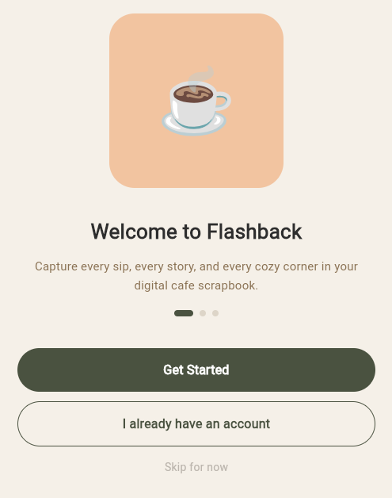
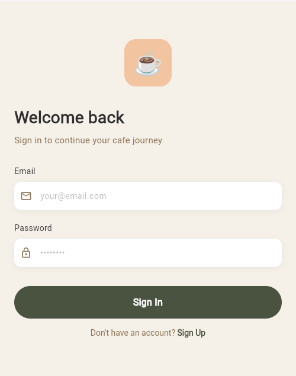
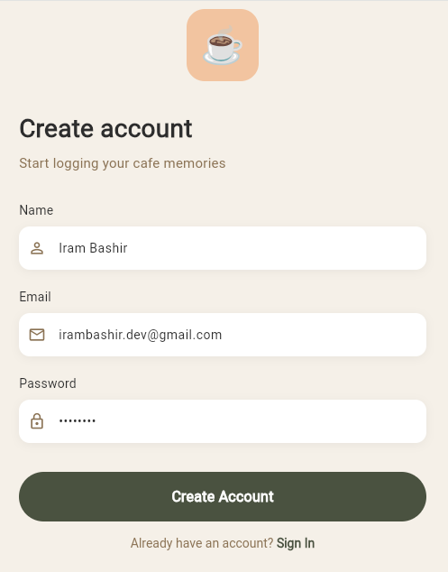
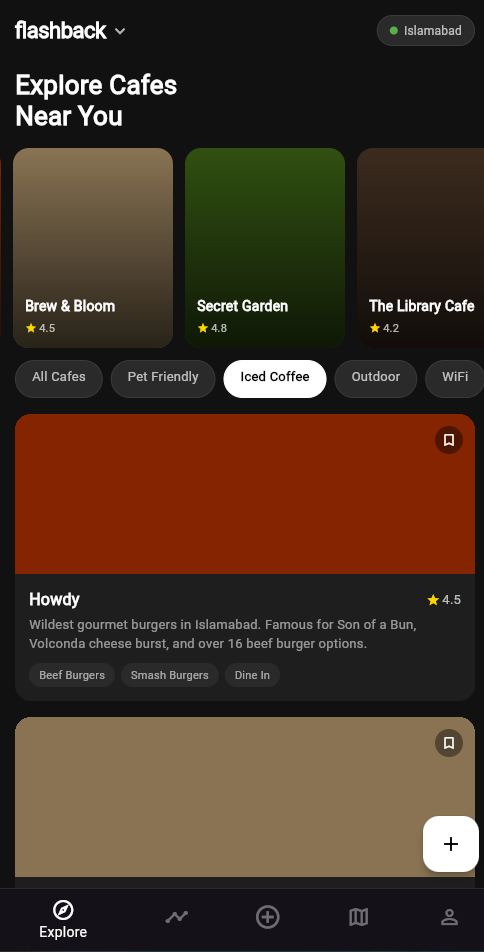
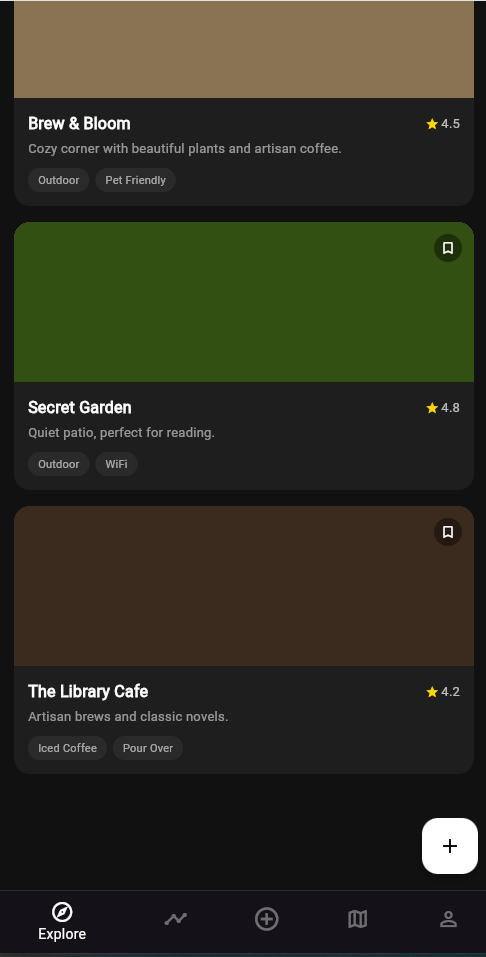
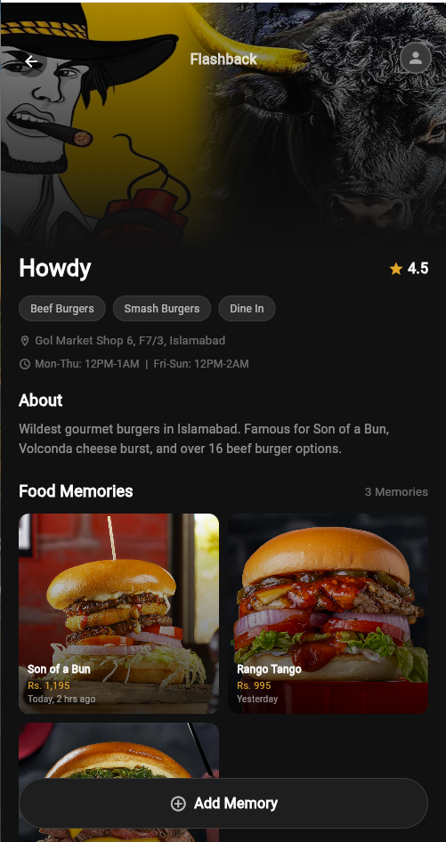
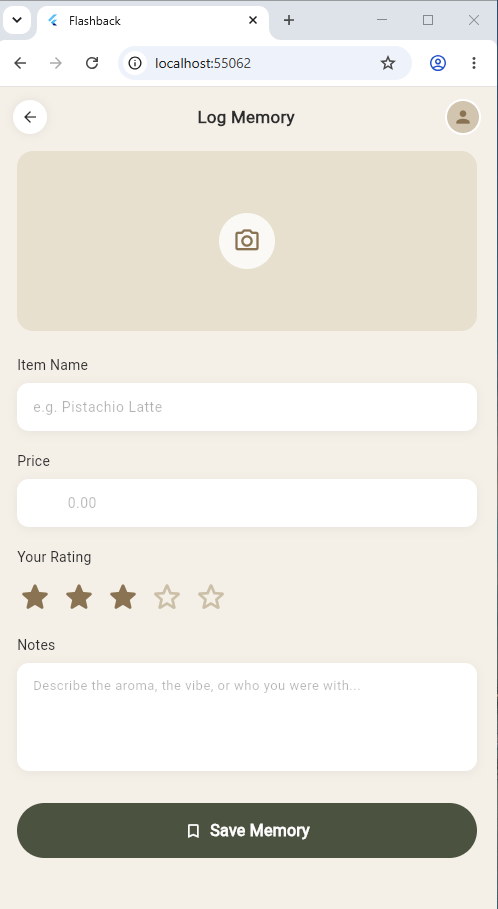
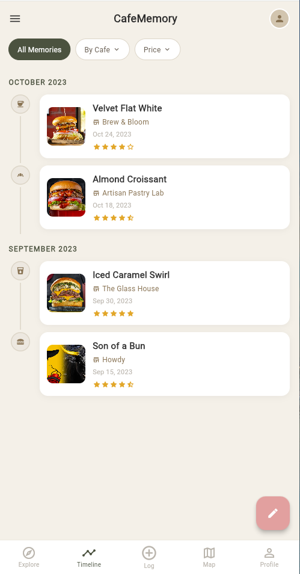
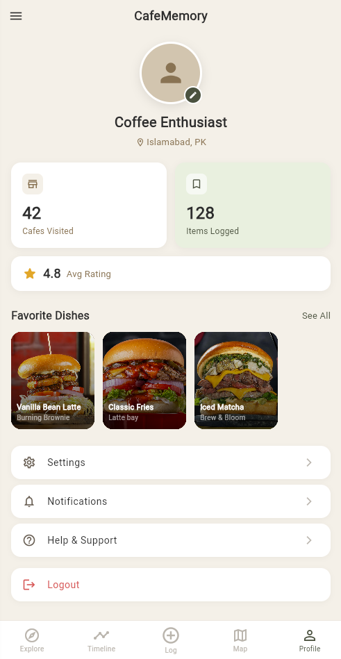
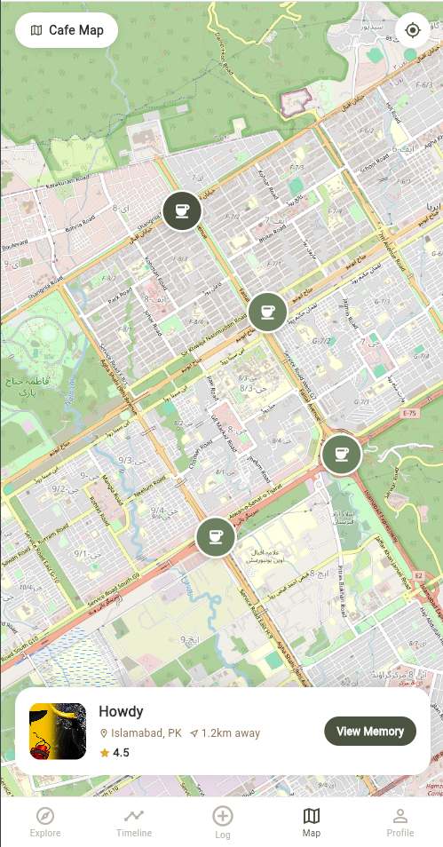

# Flashback 🍜

A personal restaurant and cafe memory diary app built with Flutter. Explore cafes near you, log food memories with photos and ratings, browse your timeline, and share experiences with friends.

> Built as a portfolio project while learning Flutter — transitioning from a React/Node.js background into mobile development.

---

## Screenshots

### Onboarding Screen


### Get Started Screen  


### Create Account Screen


### Home Screen



### Cafe Detail Screen


### Log Memory Screen


### Timeline Screen


### Profile Screen


### Cafe Map



---

## Features

- **Onboarding** — 3-screen intro flow with swipeable pages and animated dot indicators
- **Authentication** — Email/password login and signup via Firebase Auth
- **Explore** — Browse nearby cafes and restaurants with horizontal featured cards and filter chips
- **Cafe Detail** — Full cafe profile with hero image, tags, location, timings, about section, and food memories grid
- **Log Memory** — Upload a photo, enter item name, price, star rating (1–5), and personal notes
- **Timeline** — Chronological feed of all saved memories grouped by month
- **Map View** — Interactive OpenStreetMap with custom cafe markers and bottom sheet on tap
- **Profile** — User stats (cafes visited, items logged, avg rating), favorite dishes, and settings
- **Firebase Backend** — Firestore for data, Firebase Storage for photos, Firebase Auth for login *(in progress)*
- **Offline Support** — Firestore local caching so app works without internet

---

## Tech Stack

| Category | Technology |
|----------|-----------|
| Framework | Flutter (Dart) |
| State Management | Provider |
| Backend | Firebase (Firestore, Auth, Storage) |
| Maps | flutter_map + OpenStreetMap (no API key required) |
| Design | Figma |
| Version Control | Git / GitHub |

---
## Project Structure
 
```
lib/
├── main.dart                   # App entry point
├── models/
│   └── cafe.dart               # CafeData & FoodMemory models
├── data/
│   └── dummy_data.dart         # Static data (Firebase replacement coming)
├── screens/
│   ├── onboarding_screen.dart  # 3-screen intro flow
│   ├── auth_screen.dart        # Login & signup
│   ├── home_screen.dart        # Explore cafes
│   ├── cafe_detail_screen.dart # Cafe profile + memories
│   ├── log_memory_screen.dart  # Add a new memory
│   ├── timeline_screen.dart    # All memories chronologically
│   ├── map_screen.dart         # OpenStreetMap view with cafe markers
│   └── profile_screen.dart     # User profile & settings
└── widgets/
    ├── featured_card.dart      # Horizontal scroll cafe card
    └── cafe_list_card.dart     # Vertical list cafe card
```
 
---

## Getting Started

### Prerequisites

- Flutter SDK 3.x — [Install Flutter](https://docs.flutter.dev/get-started/install)
- Android Studio (for emulator) or a physical Android device
- Firebase project *(for backend features)*

### Run Locally

```bash
# Clone the repo
git clone https://github.com/IramBashir/flashback.git
cd flashback

# Install dependencies
flutter pub get

# Run on Chrome (web)
flutter run -d chrome

# Run on Android emulator or device
flutter run
```

### Environment Setup

1. Create a Firebase project at [console.firebase.google.com](https://console.firebase.google.com)
2. Enable Firestore, Authentication, and Storage
3. Download `google-services.json` and place in `android/app/`

> Note: Map view uses OpenStreetMap via flutter_map — no API key required.
---


## Current Status
 
| Feature | Status |
|---------|--------|
| Home Screen UI | ✅ Complete |
| Cafe Detail Screen | ✅ Complete |
| Log Memory Form | ✅ Complete |
| Timeline Screen | ✅ Complete |
| Profile Screen | ✅ Complete |
| Map View (OpenStreetMap) | ✅ Complete |
| Friends Sharing | 📋 Planned |
| App Store Deployment | 📋 Planned |
| Onboarding Flow | ✅ Complete |
| Firebase Auth (Login/Signup) | ✅ Complete |
| Bottom Nav (all screens) | ✅ Complete |
| Image Picker (Camera/Gallery) | ✅ Complete |
| Firebase Backend (Firestore) | 🔄 In Progress |

---

## About the Developer

**Iram Bashir**
MS Computer Science — FAST-NUCES, Islamabad

Previously worked as a Software Developer at Jin Tech (1 year) building full-stack web apps with React, TypeScript, Node.js, and NestJS. Currently learning Flutter and transitioning into mobile development.

- GitHub: [github.com/IramBashir](https://github.com/IramBashir)
- LinkedIn: [linkedin.com/in/irambashir](https://www.linkedin.com/in/irambashir/)

